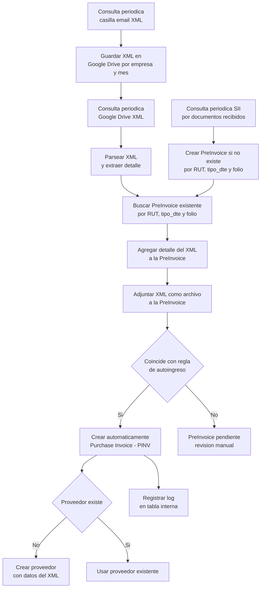

# 🧾 ERPNext Chile Factura

Este módulo extiende ERPNext para integrar automáticamente la recepción de facturas desde el SII de Chile, gestionar los XML de respaldo y generar facturas de compra (`Purchase Invoice`) a partir de reglas personalizables.

---

## ⚙️ Instalación

```bash
# Clona el repositorio dentro del directorio de apps de tu sitio ERPNext
cd ~/frappe-bench/apps
git clone https://github.com/tonicanada/erpnext_chile_factura.git

# Instala la app en tu sitio
cd ~/frappe-bench
bench --site tu_sitio install-app erpnext_chile_factura
```

Esto instalará todos los Doctypes necesarios.

---

## 🛠 Configuración inicial

### 1. Conexión a SimpleAPI (SII)

Configura el Doctype `SimpleAPI RCV Setup` para cada empresa, con los siguientes datos:
- API Key
- RUT
- Ambiente (`certificado`, `producción`, etc.)
- Otros parámetros necesarios para conectarse a la API del SII vía SimpleAPI.

### 2. Sincronización con Google Drive

Configura los siguientes Doctypes:
- `SII Google Drive Sync Config`: indica empresa y tipo de sincronización (`preinvoice`).
- `SII Google Drive Carpeta`: define la carpeta Drive de cada empresa (puede incluir subcarpetas por mes).

### 3. Procesamiento externo de correos XML

Debes clonar y configurar este repositorio:  
👉 [dte_email_xml_processor_chile](https://github.com/tonicanada/dte_email_xml_processor_chile)

Este cron externo realiza:
- Lectura de correos desde `dte@tecton.cl`.
- Clasificación por empresa y guardado en la carpeta correspondiente de Google Drive.
- Reenvío a las casillas de los contadores de cada empresa.

---

## 🔁 Automatización

La app incluye 2 crons principales:

1. **Sincronización de DTE desde el SII:**
   - Pregunta por nuevas facturas electrónicas usando SimpleAPI.
   - Crea o actualiza registros `PreInvoice` por empresa y por mes.

2. **Importación automática de XML desde Google Drive:**
   - Recorre las carpetas de Drive y busca nuevos XMLs.
   - Si encuentra una `PreInvoice` correspondiente (por RUT + folio + tipo DTE), importa los detalles y marca como `tiene_xml_importado`.

---

## 🧠 Reglas de Autoingreso PINV

Define reglas por empresa en el Doctype `Reglas de Autoingreso PINV`. Las condiciones permiten evaluar:

- Proveedor (RUT)
- Contenido del ítem (nombre + descripción)
- Y más...

Y como acción puedes definir:
- Cuenta contable
- Centro de costo
- Proyecto
- Bodega
- Ítem sugerido

---

## ⚡ Ejecución del Autoingreso

Existen 2 formas de ejecutar el ingreso automático de facturas de compra desde `PreInvoice`:

1. **Masiva** desde el Doctype `Ejecutor Autoingreso PINV`, que entrega un reporte detallado de resultados.
2. **Individual**, desde el botón de cada `PreInvoice`.

---

## 🧪 Ejecución manual de otras funciones

1. **Actualizar Preinvoices desde el SII manualmente:**  
   Usa el Doctype `PreInvoice Sync`.

2. **Importar ZIP de XML manualmente:**  
   Usa el Doctype `XML Importer`.

---

## 🧭 Diagrama de flujo general (Mermaid)


