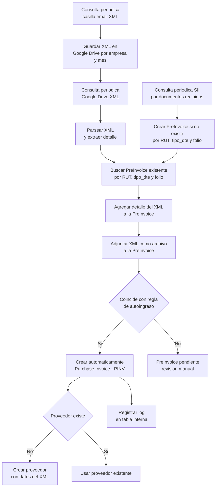

# 🧾 ERPNext Chile Factura

Este módulo extiende ERPNext para integrar automáticamente la recepción de facturas desde el SII de Chile, gestionar los XML de respaldo y generar facturas de compra (`Purchase Invoice`) a partir de reglas personalizables.

---

## ⚙️ Instalación

```bash
# Clona el repositorio dentro del directorio de apps de tu sitio ERPNext
cd ~/frappe-bench/apps
git clone https://github.com/tonicanada/erpnext_chile_factura.git

# Instala la app en tu sitio
cd ~/frappe-bench
bench --site tu_sitio install-app erpnext_chile_factura
```

Esto instalará todos los Doctypes necesarios.

---

## 🛠 Configuración inicial

### 1. Ajustes globales de integración

Configura el Doctype **`ERPNext SII - Ajustes Generales`** (singleton). Aquí se definen opciones clave que afectan el comportamiento de toda la app:

- `campo_rut_proveedor`: define si el campo usado para buscar proveedores será `tax_id` o un campo personalizado como `rut`.
- `naming_supplier`: define si el nombre del proveedor se genera con el **RUT** o con la **Razón Social**.

### 2. Conexión a SimpleAPI (SII)

Configura el Doctype `SimpleAPI RCV Setup` para cada empresa, con los siguientes datos:
- Token API (header `Authorization`)
- RUT Certificado (Representante Legal)
- Password Certificado
- Certificado digital `.pfx`
- Ambiente (`certificado`, `producción`, etc.)
- URL del endpoint por período (`{month}` y `{year}`)

### 3. Sincronización con Google Drive

Configura los siguientes Doctypes:
- `SII Google Drive Sync Config`: indica empresa y tipo de sincronización (`preinvoice`).
- `SII Google Drive Carpeta`: define la carpeta Drive de cada empresa (puede incluir subcarpetas por mes).

### 4. Procesamiento externo de correos XML

Debes clonar y configurar este repositorio:  
👉 [dte_email_xml_processor_chile](https://github.com/tonicanada/dte_email_xml_processor_chile)

Este cron externo realiza:
- Lectura de correos desde `dte@tecton.cl`.
- Clasificación por empresa y guardado en la carpeta correspondiente de Google Drive.
- Reenvío a las casillas de los contadores de cada empresa.

---


## 🔁 Automatización

La app incluye 2 crons principales:

1. **Sincronización de DTE desde el SII:**
   - Pregunta por nuevas facturas electrónicas usando SimpleAPI.
   - Crea o actualiza registros `PreInvoice` por empresa y por mes.

2. **Importación automática de XML desde Google Drive:**
   - Recorre las carpetas de Drive y busca nuevos XMLs.
   - Si encuentra una `PreInvoice` correspondiente (por RUT + folio + tipo DTE), importa los detalles y marca como `tiene_xml_importado`.

---

## 🧠 Reglas de Autoingreso PINV

Define reglas por empresa en el Doctype `Reglas de Autoingreso PINV`. Las condiciones permiten evaluar:

- Proveedor (RUT)
- Contenido del ítem (nombre + descripción)
- Y más...

Y como acción puedes definir:
- Cuenta contable
- Centro de costo
- Proyecto
- Bodega
- Ítem sugerido

---

## ⚡ Ejecución del Autoingreso

Existen 2 formas de ejecutar el ingreso automático de facturas de compra desde `PreInvoice`:

1. **Masiva** desde el Doctype `Ejecutor Autoingreso PINV`, que entrega un reporte detallado de resultados.
2. **Individual**, desde el botón de cada `PreInvoice`.

---

## 🧪 Ejecución manual de otras funciones

1. **Actualizar Preinvoices desde el SII manualmente:**  
   Usa el Doctype `PreInvoice Sync`.

2. **Importar ZIP de XML manualmente:**  
   Usa el Doctype `XML Importer`.

---

## 🧭 Diagrama de flujo general (Mermaid)


```mermaid
flowchart TD
  A[Consulta periodica<br>casilla email XML] --> B[Guardar XML en<br>Google Drive por empresa y mes]
  B --> C[Consulta periodica<br>Google Drive XML]
  C --> D[Parsear XML<br>y extraer detalle]

  E[Consulta periodica SII<br>por documentos recibidos] --> F[Crear PreInvoice si no existe<br>por RUT, tipo_dte y folio]

  D --> G[Buscar PreInvoice existente<br>por RUT, tipo_dte y folio]
  F --> G

  G --> H[Agregar detalle del XML<br>a la PreInvoice]
  H --> I[Adjuntar XML como archivo<br>a la PreInvoice]
  I --> J{Coincide con regla<br>de autoingreso}

  J -- Si --> K[Crear automaticamente<br>Purchase Invoice - PINV]
  J -- No --> L[PreInvoice pendiente<br>revision manual]

  K --> M{Proveedor existe}
  M -- No --> N[Crear proveedor<br>con datos del XML]
  M -- Si --> O[Usar proveedor existente]

  K --> P[Registrar log<br>en tabla interna]

```


## Documentación técnica adicional

Para detalles técnicos y notas específicas sobre funcionalidades como el autocompletado del campo `tipo_dte` desde `tipo_factura`, consulta el archivo [NOTAS.md](erpnext_chile_factura/erpnext_chile_sii_integration/docs/NOTAS.md).

Este archivo contiene información importante para desarrolladores sobre compatibilidades y configuraciones específicas para entornos como Constructora Tecton.


## 🛡️ Licencia

Este proyecto está licenciado bajo **Creative Commons Attribution-NonCommercial-NoDerivatives 4.0 International (CC BY-NC-ND 4.0)**.

Esto significa que puedes ver, compartir y clonar este repositorio, **pero no puedes usarlo con fines comerciales** ni crear versiones derivadas sin autorización expresa del autor.

Para más detalles, puedes consultar la licencia completa en:  
[https://creativecommons.org/licenses/by-nc-nd/4.0/](https://creativecommons.org/licenses/by-nc-nd/4.0/)

© 2025 Antonio Cañada Momblant
